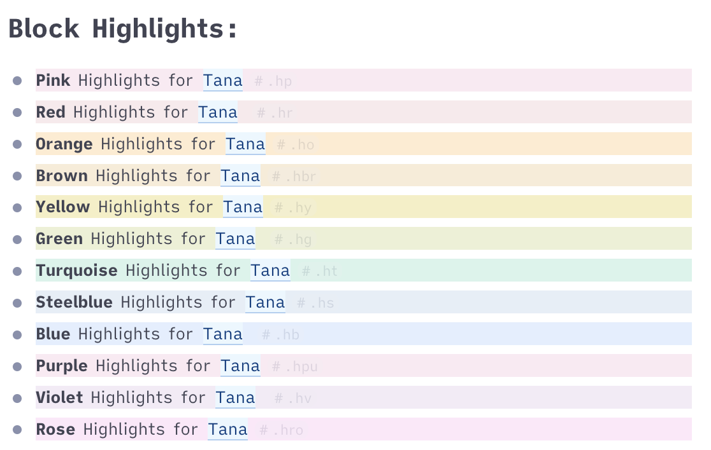
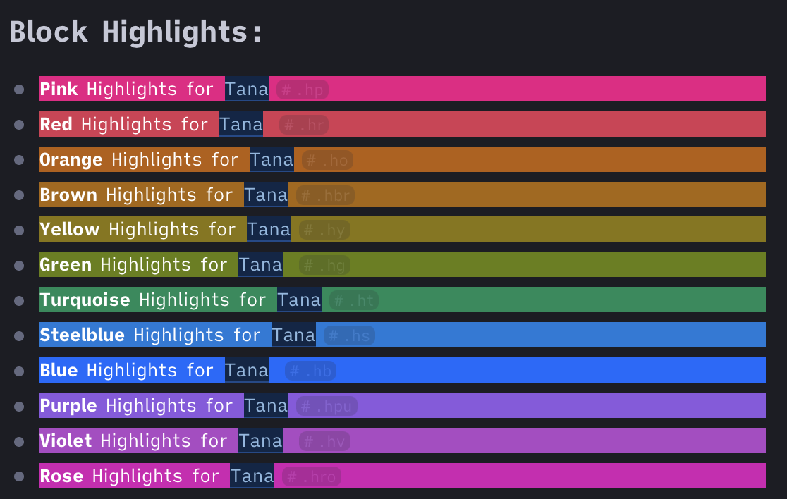

#  Block Highlights
This CSS snippet adds new tags for block highlights supporting light and dark mode. The tags are faded when not hovered to not disturb the experience.
- Pink: `#.hp` or `#.pink`
- Red: `#.hr` or `#.red`
- Orange: `#.ho` or `#.orange`
- Brown: `#.hbr` or `#.brown`
- Yellow: `#.hy` or `#.yellow`
- Green: `#.hg` or `#.green`
- Turquoise: `#.ht` or `#.turquoise`
- Steelblue: `#.hs` or `#.steelblue`
- Blue: `#.hb` or `#.blue`
- Purple: `#.hpu` or `#.purple`
- Violet: `#.hv` or `#.violet`
- Rose: `#.hro` or `#.rose`

Just add [this snippet](https://github.com/rcvd/Tana-CSS-Snippets/blob/d76806b4d3f4674482da29150a19e3624429bede/Custom%20Formats/custom-formats.css) using a browser plugin like stylus (Firefox or Chrome) or cascadea (Safari).
