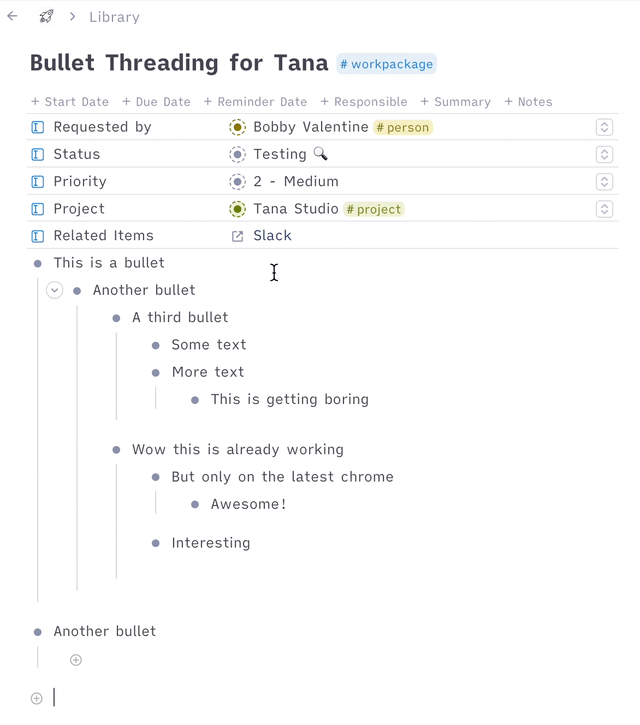

#  Bullet Threading
This CSS snippet highlights the path to the focused bullet.

Just add [this snippet](https://github.com/rcvd/Tana-CSS-Snippets/blob/484edbcd8456af410cdcb590771458330d826a39/Bullet%20Threading/bullet-threading.css) using a browser plugin like stylus (Firefox or Chrome) or cascadea (Safari).
