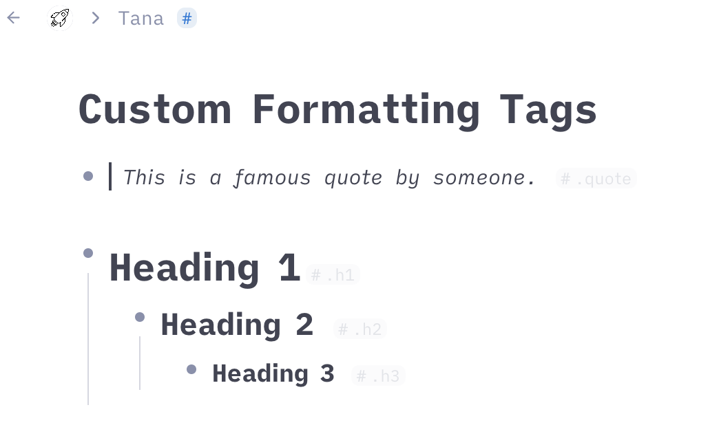

#  Custom Formats
This CSS snippets adds new tags for quotes and headings. The tags are faded when not hovered to not disturb the experience.

Just add [this snippet](https://github.com/rcvd/Tana-CSS-Snippets/blob/205054d4ec4cfcbfacb643632c63109ff83e18b5/Tag%20Colors%20(Dark%20Mode)/tag-colors-darkmode.css) using a browser plugin like stylus (Firefox or Chrome) or cascadea (Safari).
