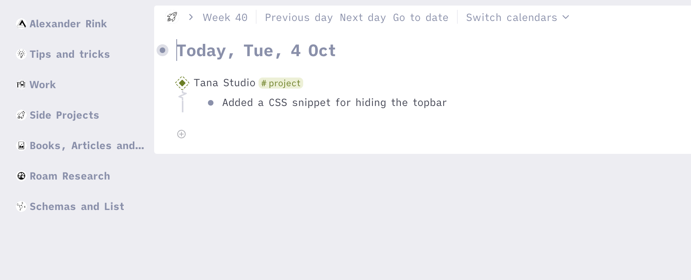
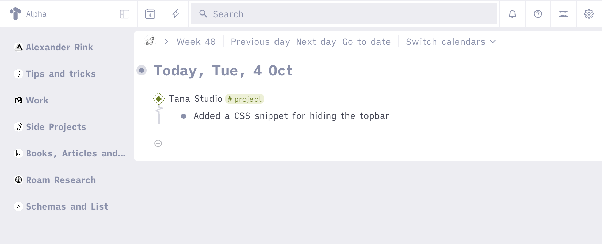

#  Hide Topbar
This CSS snippets hides the topbar, please make sure you know all relevant keyboard shortcuts!

Just add [this snippet](https://github.com/rcvd/Tana-CSS-Snippets/blob/8dda4bb059bb846ee6b7a36edea2f80af8e68194/Main%20Width%20Limit/main-width-limit.css) using a browser plugin like stylus (Firefox or Chrome) or cascadea (Safari).
