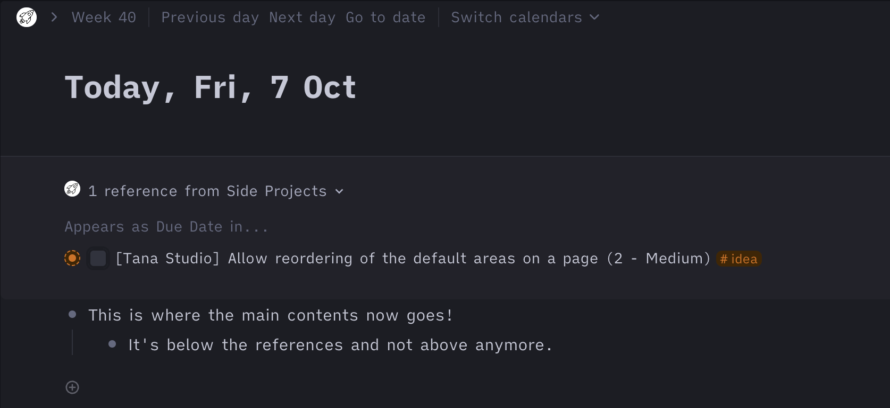

#  Reorder Page Areas
This CSS snippet allows reordering the different elemens of a page (fields, content, references). This allows putting the references first, for example.

Just add [this snippet](https://github.com/rcvd/Tana-CSS-Snippets/blob/a2747a4eca8c2b68ea6429ade955dfbd924c0f96/Reorder%20Page%20Areas/reorder-areas.css) using a browser plugin like stylus (Firefox or Chrome) or cascadea (Safari).
