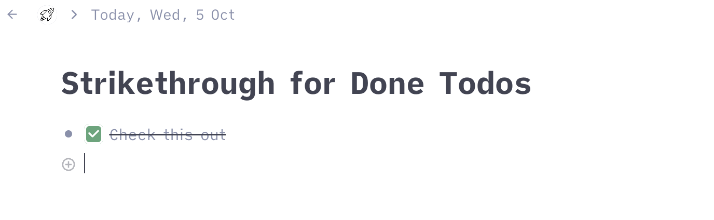

#  Striketrough Done Todos
This CSS snippets limits the main content width to 800px to increase the readability.

Just add [this snippet](https://github.com/rcvd/Tana-CSS-Snippets/blob/7a9b0fdc3822258637703f948b970cf78a073c2b/Strikethrough%20Done/striketrough.css) using a browser plugin like stylus (Firefox or Chrome) or cascadea (Safari).
