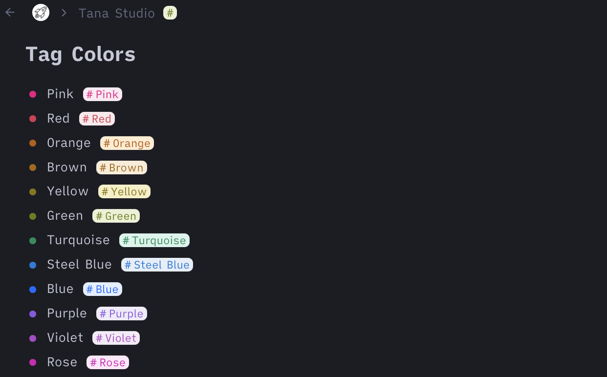
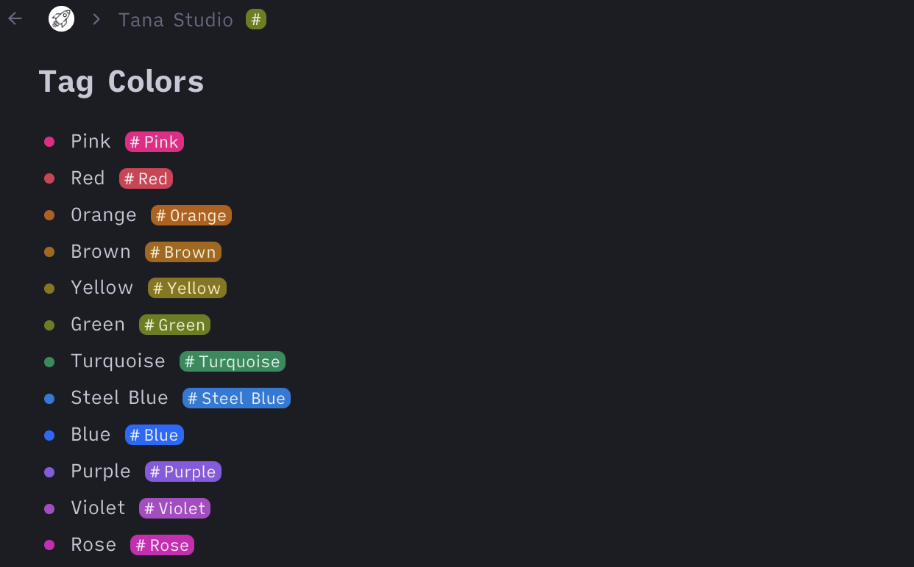

#  Tag Colors for Dark Mode
This CSS snippets replaces the various different tag colors (which are very bright) with something more convenient for dark mode.

Just add this snippet using a browser plugin like stylus (Firefox or Chrome) or cascadea (Safari).
